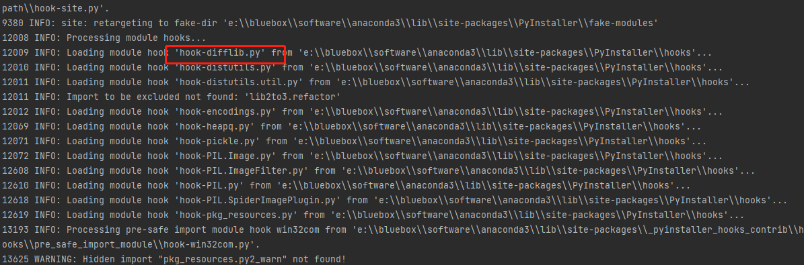
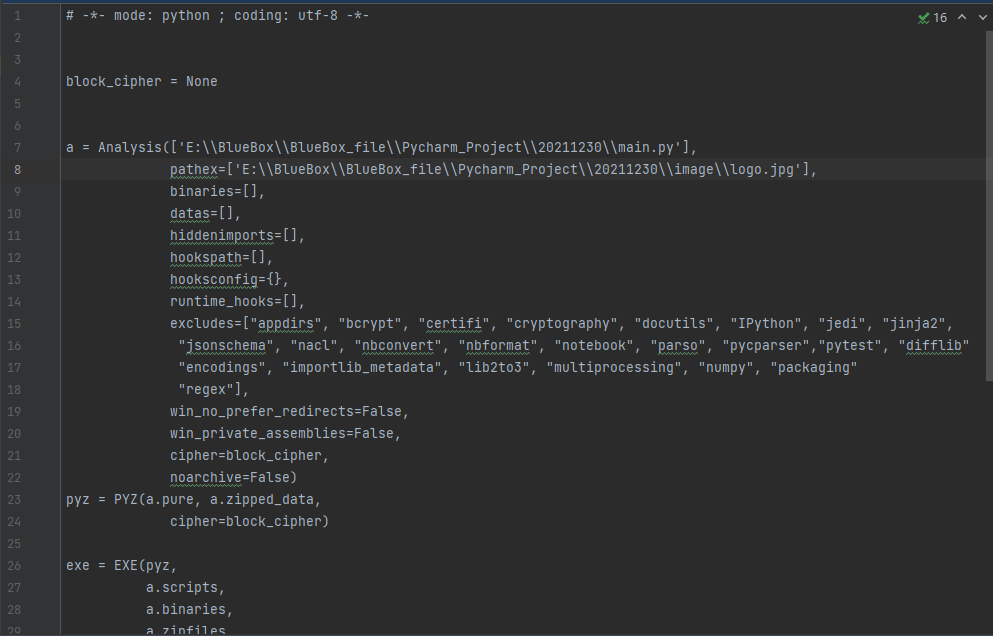

# 二维码生成器

## 参考皮卡丘的音乐播放器

* 添加自制ico角标以及打包的图标

* 添加二维码内置logo

* 修改BlueBoxPlayer.spec文件以减小打包exe文件大小，此应用缩小了10倍

* 剩下全是学习 哭泣

打包命令：
pyinstaller -F -w --icon="E:\BlueBox\BlueBox_file\Pycharm_Project\20211230\image\logo.ico
" E:\BlueBox\BlueBox_file\Pycharm_Project\20211230\main.py -n MakeQrcode_BlueBox


-F：仅仅生成一个文件，不暴露其他信息，启动较慢。

--icon=“” 添加ico图标的绝对路径 ico应该为多尺寸ico图，使用ToYcon生成

-w：窗口模式打包，不显示控制台。

-n：重命名打包好的exe文件

### 如何缩小打包exe文件大小(来自[皮卡丘的公众号](https://mp.weixin.qq.com/s/7jNrnC_XdF9q9N5GWyfW6Q))

#### 1 先使用pyinstaller命令生成spec文件
```
pyinstaller -F -w --icon="E:\BlueBox\BlueBox_file\Pycharm_Project\20211230\image\logo.ico
" E:\BlueBox\BlueBox_file\Pycharm_Project\20211230\main.py -n MakeQrcode_BlueBox
```

#### 2 将生成过程中未使用的py依赖包添加到excludes（MakeQrcode_BlueBox.spec的第15行）
未使用的py依赖包，例如difflib

写入excludes里


#### 依赖spec文件再次打包
```buildoutcfg
pyinstaller -F MakeQrcode_BlueBox.spec


```

### 如何将路径上的图片打包

#### 将图片的绝对路径（调用的时候也要使用绝对路径）写入spec文件中的pathex


