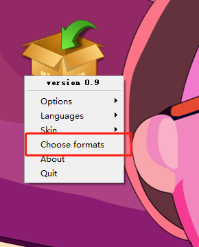

# 音乐播放器

## 参考皮卡丘的音乐播放器

* 添加自制ico角标以及打包的图标

* 修复打包后的文件无法依赖setting文件的错误

* 剩下全是学习 哭泣

打包命令：
pyinstaller -F  -w --icon="E:\BlueBox\BlueBox_file\Pycharm_Project\20211223\123.ico" E:\
BlueBox\BlueBox_file\Pycharm_Project\20211223\main.py -n BlueBoxPlayer

-F：仅仅生成一个文件，不暴露其他信息，启动较慢。

--icon=“” 添加ico图标的绝对路径 ico应该为多尺寸ico图，使用ToYcon生成

-w：窗口模式打包，不显示控制台。

-n：重命名打包好的exe文件

### 如何生成多尺寸的ico图标

#### 1 打开ToYcon.exe，桌面出现一个小盒子

#### 2 右击选择 “choose formats”

#### 3 选择 “32 bits”， 点击 “Select All”， 再选择 “ok”

#### 4 将png文件（不超过256*256 像素）拖拽进入盒子中，会在png同一文件夹生成ico图标

